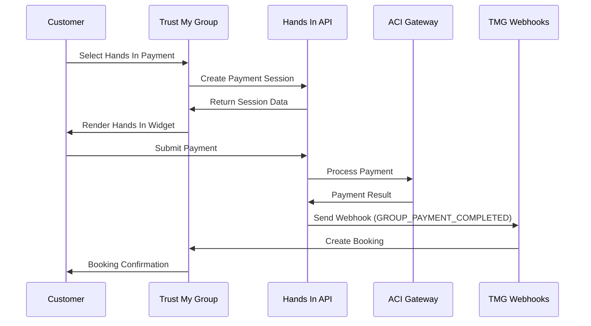
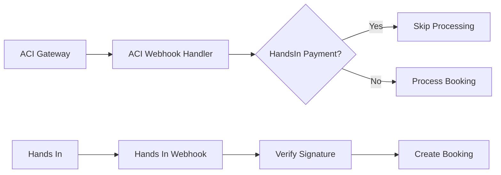

# Product Requirements Document (PRD)
# Trust My Group - Hands In Integration

**Document Version:** 1.0  
**Date:** October 6, 2025  
**Owner:** Hands In Integration Team  
**Reviewers:** Engineering, Business Development, Customer Success  

---

## Executive Summary

Trust My Group requires integration with Hands In's payment orchestration platform to enable their customers to use Hands In's flexible payment solutions (multi-card and group payments) within Trust My Group's existing checkout flow. This integration will connect through Hands In's existing SDK, API, and webhook systems while maintaining Trust My Group's current ACI payment processing infrastructure.

### Key Integration Points
- **API Integration**: Create payment sessions via Hands In's multi-card and group payment APIs
- **SDK Integration**: Hands In payment widgets embedded in Trust My Group's checkout
- **Webhook Integration**: Real-time payment event notifications from Hands In to Trust My Group
- **ACI Webhook Filtering**: Modify Trust My Group's ACI webhook handler to ignore Hands In payments

---

## 1. Project Overview

### 1.1 Business Objectives
- Enable Trust My Group customers to access Hands In's flexible payment options (multi-card split payments, group payments)
- Maintain Trust My Group's existing ACI payment processing relationship and workflow
- Provide seamless checkout experience with minimal disruption to current booking flow
- Enable real-time payment status synchronization between systems

### 1.2 Success Metrics
- **Technical KPIs**:
  - Payment session creation latency < 500ms
  - Webhook delivery success rate > 99.5%
  - SDK load time < 2 seconds
  - Zero false positive bookings from ACI webhook filtering

- **Business KPIs**:
  - Integration go-live within 8 weeks
  - Zero payment processing downtime during integration
  - Customer satisfaction score maintained or improved
  - Successful identification and filtering of Hands In payments in ACI webhooks

---

## 2. Technical Requirements

### 2.1 Trust My Group Implementation Requirements

#### 2.1.1 Hands In API Integration
**Status**: New Development Required by Trust My Group

**Required API Endpoints to Integrate**:

1. **Multi-Card Payment Creation**:
   ```
   POST /multi-card
   ```
   
2. **Group Payment Creation**:
   ```
   POST /group-payments
   ```

**API Integration Requirements**:
- API Key authentication with Hands In
- Create payment sessions for customer checkout
- Handle payment metadata for booking association
- Error handling and retry logic for API failures
- Support for both multi-card and group payment flows

#### 2.1.2 Hands In SDK Integration
**Status**: Implementation Required by Trust My Group

**SDK Features Available**:
- Multi-card payment widget (`renderMultiCard`)
- Group payment widget (`renderGroupPayment`)
- Responsive design for mobile/desktop
- Real-time payment status updates
- Event handling for payment completion

**Integration Methods**:
```javascript
// Load Hands In SDK
<script src="https://cdn.handsin.com/v1/sdk.js"></script>

// Multi-Card Widget Integration
window.handsin({
  merchantId: 'trust_my_group_merchant_id',
  environment: 'production'
}).renderMultiCard('payment-container', {
  live: true,
  merchantId: 'trust_my_group',
  multiCardId: 'mc_session_123',
  style: { maxWidth: '600px' },
  multiCardDefaultEnabled: true
});
```

#### 2.1.3 Webhook Receiver Implementation
**Status**: New Development Required by Trust My Group

**Required Webhook Endpoint**: `POST /webhooks/handsin`

**Webhook Events to Handle**:
- `MULTI_CARD_COMPLETED` - Multi-card payment completed
- `MULTI_CARD_CANCELLED` - Multi-card payment cancelled
- `MULTI_CARD_EXPIRED` - Multi-card payment expired
- `GROUP_PAYMENT_COMPLETED` - Group payment completed
- `GROUP_PAYMENT_CANCELLED` - Group payment cancelled
- `GROUP_PAYMENT_EXPIRED` - Group payment expired
- `REFUND_COMPLETED` - Payment refunded

**Webhook Payload Structure** (Based on EventData interface):
```json
{
  "id": "evt_abc123",
  "eventType": "MULTI_CARD_COMPLETED",
  "merchantId": "trust_my_group",
  "createdAt": "2025-10-06T14:30:00Z",
  "multiCardId": "mc_payment_123",
  "data": {
    "id": "mc_payment_123",
    "status": "COMPLETED",
    "amountMoney": {
      "amount": 15000,
      "currency": "USD"
    },
    "metaData": {
      "orderId": "tmg_order_789",
      "customerId": "customer_123",
      "createdBy": "trust_my_group"
    }
  }
}
```

### 2.2 Trust My Group Requirements

#### 2.2.1 ACI Webhook Filtering
**Identification Methods**:
- Primary: Check `metadata.createdBy === 'handsin'` in ACI webhook payload
- Fallback: Statement descriptor patterns (if available)
- Transaction reference patterns (if configured)

**Implementation**:
```javascript
// Modified ACI webhook handler
function handleACIWebhook(webhookPayload) {
  // Check if payment was created by Hands In
  if (webhookPayload.metadata?.createdBy === 'handsin') {
    // Skip processing - this will be handled by Hands In webhooks
    console.log('Skipping Hands In originated payment:', webhookPayload.id);
    return;
  }
  
  // Process normal ACI payments for booking creation
  processACIEvent(webhookPayload);
}
```

#### 2.2.2 Multi-Card Payment Creation
**API Endpoint**: `POST https://api.handsin.com/v1/multi-card`

**Request Example**:
```javascript
const createMultiCardPayment = async (orderData) => {
  const response = await fetch('https://api.handsin.com/v1/multi-card', {
    method: 'POST',
    headers: {
      'x-api-key': ' ' + process.env.HANDSIN_API_KEY,
      'Content-Type': 'application/json'
    },
    body: JSON.stringify({
      idempotencyKey: `tmg_${orderData.id}_${Date.now()}`,
      amountMoney: {
        amount: orderData.totalAmount, // in cents
        currency: 'USD'
      },
      customerId: orderData.customerId,
      lineItemParams: orderData.items.map(item => ({
        item: {
          name: item.name,
          amountMoney: { amount: item.price, currency: 'USD' }
        },
        quantity: item.quantity
      })),
      metaData: {
        orderId: orderData.id,
        customerId: orderData.customerId,
        createdBy: 'trust_my_group'
      },
      pageOptions: {
        successUrl: `https://trustmygroup.com/booking-success/${orderData.id}`,
        cancelUrl: `https://trustmygroup.com/checkout/${orderData.id}`,
        maxNumberCards: 4
      }
    })
  });
  
  return response.json();
};
```

#### 2.2.3 Group Payment Creation  
**API Endpoint**: `POST https://api.handsin.com/v1/group-payments`

**Request Example**:
```javascript
const createGroupPayment = async (orderData, invitees) => {
  const response = await fetch('https://api.handsin.com/v1/group-payments', {
    method: 'POST',
    headers: {
      'x-api-key': process.env.HANDSIN_API_KEY,
      'Content-Type': 'application/json'
    },
    body: JSON.stringify({
      idempotencyKey: `tmg_group_${orderData.id}_${Date.now()}`,
      amountMoney: {
        amount: orderData.totalAmount,
        currency: 'USD'
      },
      customerId: orderData.ownerId,
      invites: invitees.map(invitee => ({
        firstName: invitee.firstName,
        email: invitee.email
      })),
      splitType: 'EQUAL',
      splitAllocation: invitees.length + 1, // +1 for owner
      metaData: {
        orderId: orderData.id,
        ownerId: orderData.ownerId,
        createdBy: 'trust_my_group'
      },
      pageOptions: {
        successUrl: `https://trustmygroup.com/booking-success/${orderData.id}`,
        cancelUrl: `https://trustmygroup.com/checkout/${orderData.id}`
      },
      expirationDate: new Date(Date.now() + 7 * 24 * 60 * 60 * 1000) // 7 days
    })
  });
  
  return response.json();
};
```

#### 2.2.4 Frontend Checkout Integration
**Checkout Page Modifications**:
```html
<!-- Hands In SDK -->
<script src="https://cdn.handsin.com/js/sdk.js"></script>

<!-- Enhanced Payment Options -->
<div class="payment-methods">
  <input type="radio" name="payment" value="standard" checked>
  <label>Standard Payment</label>
  
  <input type="radio" name="payment" value="multicard">
  <label>Split Payment (Multiple Cards)</label>
</div>

<!-- Payment Method Containers -->
<div id="multicard-container" style="display: none;"></div>
```

**JavaScript Integration**:
```javascript

async function initializeMultiCardWidget() {
  try {
    // Create multi-card payment session
    const multiCardData = await createMultiCardPayment(currentOrder);
    
    // Render SDK widget
    window.handsin({
      merchantId: 'trust_my_group',
      environment: 'production'
    }).renderMultiCard('#multicard-container', {
      live: true,
      merchantId: 'trust_my_group',
      multiCardId: multiCardData.id,
      style: { maxWidth: '100%' },
      multiCardDefaultEnabled: true,
    });
  } catch (error) {
    showErrorMessage('Failed to initialize multi-card payment');
  }
}
```

#### 2.2.5 Webhook Receiver Implementation
**New Endpoint Required**: `POST /webhooks/handsin`

```javascript
const crypto = require('crypto');

app.post('/webhooks/handsin', express.json(), async (req, res) => {
  try {
    const signature = req.headers['x-handsin-signature'];
    
    // Verify webhook signature
    if (!verifyHandsInWebhookSignature(req.body, signature)) {
      return res.status(401).send('Unauthorized');
    }
    
    const { eventType, createdAt, data } = req.body;
    
    switch (eventType) {
      case 'MULTI_CARD_COMPLETED':
        await handleMultiCardCompleted(data);
        break;
        
      case 'GROUP_PAYMENT_COMPLETED':
        await handleGroupPaymentCompleted(data);
        break;
        
      case 'MULTI_CARD_CANCELLED':
      case 'MULTI_CARD_EXPIRED':
      case 'GROUP_PAYMENT_CANCELLED':
      case 'GROUP_PAYMENT_EXPIRED':
        await handlePaymentFailed(data);
        break;
        
      case 'REFUND_COMPLETED':
        await handlePaymentRefunded(data);
        break;
        
      default:
        console.log(`Unhandled webhook event: ${eventType}`);
    }
    
    res.status(200).send('OK');
  } catch (error) {
    console.error('Webhook processing error:', error);
    res.status(500).send('Internal Server Error');
  }
});

function verifyHandsInWebhookSignature(body, signature) {
  const expectedSignature = crypto
    .createHmac('sha256', process.env.HANDSIN_WEBHOOK_SECRET)
    .update(JSON.stringify(body))
    .digest('hex');
  
  return signature === expectedSignature;
}

async function handleMultiCardCompleted(data) {
  // Create booking when multi-card payment is completed
}

async function handleGroupPaymentCompleted(data) {
  // Create booking when group payment is completed

}

async function handlePaymentFailed(data) {
  // Update order status to failed
}
```

---

## 3. Data Flow Architecture

### 3.1 Payment Flow Sequence



### 3.2 Webhook Event Flow



---

## 4. Implementation Plan

### 4.1 Phase 1: Foundation Setup 
**Trust My Group Deliverables**:
- Hands In merchant account setup and API key generation
- Configure ACI connection in Hands In dashboard
- Development environment configuration
- ACI webhook handler modification for filtering payments created by Hands In

### 4.2 Phase 2: Core Integration 
**Trust My Group Deliverables**:
- Multi-card payment API integration
- Group payment API integration  
- Frontend checkout UI modifications
- Hands In SDK integration
- Hands In Webhook handler implementation

### 4.3 Phase 3: Testing & Production 
**Trust My Group Deliverables**:
- End-to-end testing in staging environment
- User acceptance testing with internal team

---

## 5. Technical Specifications

### 5.1 API Specifications

#### 5.1.1 Multi-Card Payment Creation
```
POST https://api.handsin.com/v1/multi-card
Content-Type: application/json
x-api-key:  {api_key}

{
  "idempotencyKey": "tmg_order_123_1728234567",
  "amountMoney": {
    "amount": 25000,
    "currency": "USD"
  },
  "customerId": "tmg_customer_456",
  "metaData": {
    "orderId": "tmg_order_123",
    "customerId": "tmg_customer_456",
    "createdBy": "trust_my_group"
  },
  "pageOptions": {
    "successUrl": "https://trustmygroup.com/success/123",
    "cancelUrl": "https://trustmygroup.com/checkout/123",
    "maxNumberCards": 4
  }
}

Response:
{
  "id": "mc_abc123",
  "status": "PENDING",
  "url": "https://checkout.handsin.com/m/mc_abc123",
  "amountMoney": {
    "amount": 25000,
    "currency": "USD"
  }
}
```

#### 5.1.2 Group Payment Creation
```
POST https://api.handsin.com/v1/group-payments
Content-Type: application/json
x-api-key:  {api_key}

{
  "idempotencyKey": "tmg_group_123_1728234567",
  "amountMoney": {
    "amount": 50000,
    "currency": "USD"
  },
  "customerId": "tmg_customer_456",
  "invites": [
    { "firstName": "John", "email": "john@example.com" },
    { "firstName": "Jane", "email": "jane@example.com" }
  ],
  "splitType": "EQUAL",
  "splitAllocation": 3,
  "metaData": {
    "orderId": "tmg_order_123",
    "ownerId": "tmg_customer_456",
    "createdBy": "trust_my_group"
  },
  "expirationDate": "2025-10-13T14:30:00Z"
}

Response:
{
  "id": "gp_def456",
  "status": "PENDING", 
  "url": "https://checkout.handsin.com/g/gp_def456",
  "amountMoney": {
    "amount": 50000,
    "currency": "USD"
  }
}
```

### 5.2 Webhook Specifications

#### 5.2.1 Signature Verification
```
x-handsin-signature: calculated_hmac_signature

HMAC-SHA256 signature calculated from:
JSON.stringify(request_body) using webhook_secret
```

#### 5.2.2 Event Types
- `MULTI_CARD_CREATED` - Multi-card payment created
- `MULTI_CARD_UPDATED` - Multi-card payment updated
- `MULTI_CARD_APPROVED` - Multi-card payment approved
- `MULTI_CARD_COMPLETED` - Multi-card payment completed
- `MULTI_CARD_CANCELLED` - Multi-card payment cancelled
- `MULTI_CARD_EXPIRED` - Multi-card payment expired
- `GROUP_PAYMENT_CREATED` - Group payment created
- `GROUP_PAYMENT_UPDATED` - Group payment updated
- `GROUP_PAYMENT_APPROVED` - Group payment approved
- `GROUP_PAYMENT_COMPLETED` - Group payment completed
- `GROUP_PAYMENT_CANCELLED` - Group payment cancelled
- `GROUP_PAYMENT_EXPIRED` - Group payment expired
- `REFUND_CREATED` - Refund created
- `REFUND_UPDATED` - Refund updated
- `REFUND_COMPLETED` - Refund completed
- `REFUND_REJECTED` - Refund rejected
- `REFUND_FAILED` - Refund failed

#### 5.2.3 Webhook Payload Examples

**Multi-Card Completion**:
```json
{
  "id": "evt_abc123",
  "eventType": "MULTI_CARD_COMPLETED",
  "merchantId": "trust_my_group", 
  "createdAt": "2025-10-06T14:30:00Z",
  "multiCardId": "mc_abc123",
  "data": {
    "id": "mc_abc123",
    "status": "COMPLETED",
    "amountMoney": {
      "amount": 25000,
      "currency": "USD"
    },
    "capturedMoney": {
      "amount": 25000,
      "currency": "USD"
    },
    "metaData": {
      "orderId": "tmg_order_123",
      "customerId": "tmg_customer_456",
      "createdBy": "trust_my_group"
    },
    "createdAt": "2025-10-06T14:00:00Z",
    "completedAt": "2025-10-06T14:30:00Z"
  }
}
```

**Group Payment Completion**:
```json
{
  "id": "evt_def456",
  "eventType": "GROUP_PAYMENT_COMPLETED",
  "merchantId": "trust_my_group",
  "createdAt": "2025-10-06T14:30:00Z", 
  "groupPaymentId": "gp_def456",
  "data": {
    "id": "gp_def456",
    "status": "COMPLETED",
    "ownerId": "tmg_customer_456",
    "memberIds": ["tmg_customer_456", "member_789", "member_012"],
    "amountMoney": {
      "amount": 50000,
      "currency": "USD"
    },
    "capturedMoney": {
      "amount": 50000,
      "currency": "USD"
    },
    "metaData": {
      "orderId": "tmg_order_123",
      "ownerId": "tmg_customer_456",
      "createdBy": "trust_my_group"
    },
    "createdAt": "2025-10-06T14:00:00Z",
    "completedAt": "2025-10-06T14:30:00Z"
  }
}
```

### 5.3 SDK Specifications

#### 5.3.1 Multi-Card Widget Configuration
```javascript
window.handsin({
  merchantId: 'trust_my_group',
  environment: 'production'
}).renderMultiCard('container-id', {
  live: true,
  merchantId: 'trust_my_group',
  multiCardId: 'mc_abc123',
  style: {
    maxWidth: '600px'
  },
  multiCardDefaultEnabled: true,
  onEvent: function(event) {
    // Handle SDK events
    switch(event.type) {
      case 'payment_completed':
        window.location.href = '/booking-success';
        break;
      case 'payment_failed':
        showErrorMessage(event.data.error);
        break;
    }
  }
});
```

#### 5.3.2 SDK Event Handling
**Available Events**:
- `payment_completed` - Payment successfully completed
- `payment_failed` - Payment failed
- `payment_cancelled` - Payment cancelled by user
- `widget_loaded` - Widget finished loading
- `widget_error` - Widget encountered an error

**Event Data Structure**:
```javascript
{
  type: 'payment_completed',
  data: {
    paymentId: 'mc_abc123',
    amount: 25000,
    currency: 'USD'
  }
}
```

## Appendices

### Appendix A: Hands In API Authentication
```javascript
// Environment configuration
const config = {
  development: {
    apiUrl: 'https://api-dev.handsin.com',
    apiKey: process.env.HANDSIN_DEV_API_KEY
  },
  production: {
    apiUrl: 'https://api.handsin.com', 
    apiKey: process.env.HANDSIN_PROD_API_KEY
  }
};
```

### Appendix B: Error Handling Examples
```javascript
// API Error Handling
async function createHandsInPayment(orderData) {
  try {
    const response = await fetch(`${config.apiUrl}/multi-card`, {
      method: 'POST',
      headers: {
        'x-api-key': `${config.apiKey}`,
        'Content-Type': 'application/json'
      },
      body: JSON.stringify(orderData)
    });
    
    if (!response.ok) {
      const error = await response.json();
      throw new Error(`Hands In API Error: ${error.message}`);
    }
    
    return await response.json();
  } catch (error) {
    console.error('Payment creation failed:', error);
    // Fallback to standard payment flow
    return redirectToStandardCheckout(orderData);
  }
}
```
