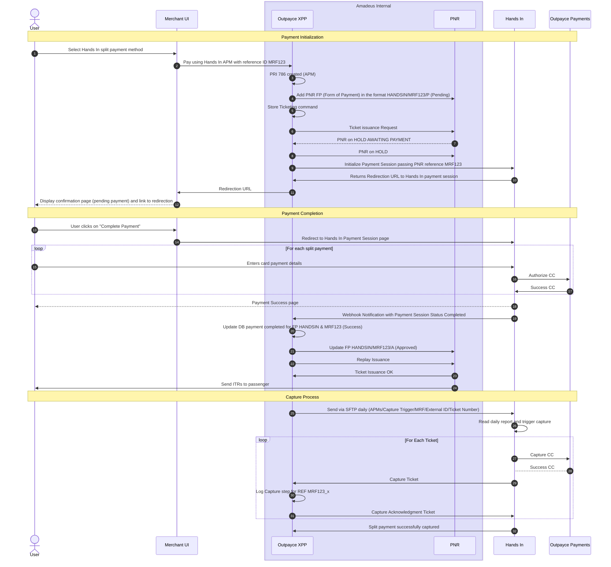

# Hands In Split Payment Flow Documentation

## Overview

This document provides a comprehensive explanation of the Hands In split payment integration flow, detailing each step of the payment process from initialization through capture. The flow involves multiple systems working together: Merchant UI, Outpayce XPP, PNR (Passenger Name Record), and the Hands In payment platform.

## UML Sequence Diagram



## System Components

### Key Actors and Systems

- **User**: The customer making a payment for a booking
- **Merchant UI**: The merchant's checkout interface (e.g., airline booking system)
- **Outpayce XPP**: Amadeus payment orchestration platform that coordinates payment processing, PNR updates, and batch settlements
- **PNR**: Passenger Name Record system (Amadeus) - the airline reservation database
- **Hands In**: The split payment orchestration platform that hosts the payment session and manages multiple card authorizations
- **Outpayce Payments**: The payment gateway that processes card authorizations and captures (underlying payment processor)

## Payment Flow Phases

The payment process is divided into three main phases:
1. **Payment Initialization** - Setting up the payment session
2. **Payment Completion** - Processing multiple payment methods
3. **Capture Process** - Finalizing and capturing authorized payments

---

## Phase 1: Payment Initialization

This phase establishes the payment session, creates necessary records in Outpayce XPP, and redirects the user to complete payment through Hands In.

### Step 1: Select Hands In Split Payment Method
**Actor**: User → Merchant UI  
**Action**: User selects Hands In as their split payment method on the Merchant UI  
**Purpose**: Initiates the Hands In Alternative Payment Method (APM) flow instead of traditional single-card payment  
**Context**: This is the entry point for the split payment journey

### Step 2: Pay Using Hands In APM with Reference ID MRF123
**Actor**: Merchant UI → Outpayce XPP  
**Action**: Merchant UI sends payment request to Outpayce XPP using Hands In APM with a unique merchant reference ID (e.g., MRF123)  
**Purpose**: Initiates the payment processing workflow through Outpayce's payment orchestration platform  
**Data Transferred**: 
  - Payment amount
  - Booking details
  - Merchant reference ID (MRF123)
  - APM type (Hands In)

### Step 3: PRI 786 Created (APM)
**Actor**: Outpayce XPP (internal processing)  
**Action**: Creates a Payment Request Identifier (PRI) 786 for this Alternative Payment Method transaction  
**Purpose**: Establishes a unique internal identifier within Outpayce XPP for tracking this payment request  
**Result**: PRI reference number generated for internal tracking

### Step 4: Add PNR FP in Format HANDSIN/MRF123/P (Pending)
**Actor**: Outpayce XPP → PNR  
**Action**: Updates the Passenger Name Record with Form of Payment (FP) in the format "HANDSIN/MRF123/P"  
**Purpose**: Links the payment session to the booking record with pending status  
**Format Breakdown**:
  - `HANDSIN` = Payment provider name
  - `MRF123` = Merchant Reference Payment ID
  - `P` = Pending status indicator

### Step 5: Store Ticketing Command
**Actor**: Outpayce XPP (internal processing)  
**Action**: Stores the ticketing command for later execution after successful payment  
**Purpose**: Preserves the ticket issuance instruction to be replayed after payment completion  
**Importance**: Critical for ensuring tickets can be issued automatically once payment succeeds

### Step 6: Ticket Issuance Request
**Actor**: Outpayce XPP → PNR  
**Action**: Submits a ticket issuance request to the PNR system  
**Purpose**: Prepares the system for ticket issuance but does not execute until payment is confirmed  
**Status**: Request queued but not executed

### Step 7: PNR on HOLD AWAITING PAYMENT (Response)
**Actor**: PNR → Outpayce XPP  
**Action**: PNR system responds that the booking is "ON HOLD AWAITING PAYMENT"  
**Purpose**: Confirms the booking reservation is active but not ticketed  
**Business Rule**: Booking is reserved but not confirmed until payment succeeds  
**Duration**: Hold period depends on airline/merchant configuration (typically 24-72 hours)

### Step 8: PNR on HOLD
**Actor**: Outpayce XPP → PNR  
**Action**: Confirms and acknowledges PNR is in HOLD status  
**Purpose**: Validates that the booking reservation is properly established  
**Result**: Ready to proceed with payment collection

### Step 9: Initialize Payment Session Passing PNR Reference MRF123
**Actor**: Outpayce XPP → Hands In  
**Action**: Initializes a payment session with Hands In, passing the merchant reference ID (MRF123)  
**Purpose**: Creates a Hands In payment session linked to the booking reference  
**Data Transferred**:
  - Merchant reference ID (MRF123)
  - Payment amount
  - Merchant credentials
  - Return URLs

### Step 10: Returns Redirection URL to Hands In Payment Session
**Actor**: Hands In → Outpayce XPP  
**Action**: Returns a unique redirection URL for the Hands In payment session  
**Purpose**: Provides the hosted payment page URL where users will complete their split payment  
**Response Format**:
```json
{
  "sessionId": "hs_session_123abc",
  "redirectUrl": "https://pay.handsin.com/session/hs_session_123abc",
  "merchantReference": "MRF123",
  "status": "pending"
}
```

### Step 11: Redirection URL
**Actor**: Outpayce XPP → Merchant UI  
**Action**: Forwards the Hands In payment session redirection URL to Merchant UI  
**Purpose**: Enables the merchant to redirect the customer to complete payment  
**Data**: Payment session URL

### Step 12: Display Confirmation Page (Pending Payment) and Link to Redirection
**Actor**: Merchant UI → User  
**Action**: Displays a confirmation page showing booking details with pending payment status and a link/button to complete payment  
**Purpose**: Informs user of successful booking initiation and provides clear next steps  
**UI Elements**:
  - Booking summary and reference
  - Payment pending notice
  - "Complete Payment" call-to-action button
  - Amount due

---

## Phase 2: Payment Completion

This phase handles the user interaction with Hands In to add multiple payment methods, authorization through Outpayce Payments, and ticket issuance upon successful payment.

### Step 13: User Clicks "Complete Payment"
**Actor**: User → Merchant UI  
**Action**: User clicks the "Complete Payment" button on the confirmation page  
**Purpose**: User initiates the redirect to Hands In payment session  
**Result**: Triggers navigation to Hands In hosted payment page

### Step 14: Redirect to Hands In Payment Session Page
**Actor**: Merchant UI → Hands In  
**Action**: Browser redirects user to the Hands In payment session page using the URL from Step 10  
**Purpose**: Transfers user to Hands In's hosted payment interface to add and authorize split payments  
**URL**: The redirection URL provided by Hands In (e.g., `https://pay.handsin.com/session/hs_session_123abc`)

### Step 15-17: For Each Split Payment (Loop)

This loop represents the iterative process of adding and authorizing multiple payment methods to complete the total payment amount.

#### Step 15: Enters Card Payment Details
**Actor**: User → Hands In  
**Action**: User enters credit card details for one portion of the split payment  
**Purpose**: Provides payment method information for authorization  
**Data Collected**:
  - Card number
  - Expiration date
  - CVV
  - Cardholder name
  - Billing address
  - Amount to charge this card

#### Step 16: Authorize CC#x REF MRF123_x
**Actor**: Hands In → Outpayce Payments  
**Action**: Sends authorization request to Outpayce Payments for the card with reference MRF123_x  
**Purpose**: Validates and authorizes the payment amount on this specific card  
**Reference Format**: `MRF123_1`, `MRF123_2`, etc. (one reference per card in the split)  
**Process**: 
  - Card validated with payment processor
  - Amount authorized (not yet captured)
  - Fraud checks performed

#### Step 17: Success CC#x REF MRF123_x
**Actor**: Outpayce Payments → Hands In  
**Action**: Returns successful authorization response for the card  
**Purpose**: Confirms this payment method is valid and authorized for the specified amount  
**Response Data**:
  - Authorization code
  - Authorization reference (MRF123_x)
  - Authorized amount
  - Card token (for future capture)

**Loop Continuation**: Steps 15-17 repeat for each card the user adds until the total authorized amount equals the booking amount.

### Step 18: Payment Success Page
**Actor**: Hands In → User  
**Action**: Displays payment success confirmation page  
**Purpose**: Confirms all payment methods have been successfully authorized  
**UI Elements**:
  - Payment success message
  - Summary of cards used and amounts
  - Total amount authorized
  - Booking reference
  - "Return to Merchant" button

### Step 19: Webhook Notification with Payment Session Status Completed
**Actor**: Hands In → Outpayce XPP  
**Action**: Sends webhook notification that the payment session is completed with all authorizations successful  
**Purpose**: Notifies Outpayce XPP to proceed with ticket issuance  
**Webhook Payload**:
```json
{
  "eventType": "PAYMENT_SESSION_COMPLETED",
  "merchantReference": "MRF123",
  "sessionId": "hs_session_123abc",
  "status": "completed",
  "totalAmount": 1000.00,
  "authorizations": [
    {"reference": "MRF123_1", "amount": 400.00, "last4": "1234"},
    {"reference": "MRF123_2", "amount": 300.00, "last4": "5678"},
    {"reference": "MRF123_3", "amount": 300.00, "last4": "9012"}
  ]
}
```

### Step 20: Update DB Payment Completed for FP HANDSIN & MRF123 (Success)
**Actor**: Outpayce XPP (internal processing)  
**Action**: Updates internal database with payment completed status for Form of Payment reference  
**Purpose**: Records successful payment authorization in Outpayce's system  
**Status Change**: PENDING → SUCCESS  
**Data Updated**:
  - Payment status
  - Authorization references
  - Timestamp
  - Amount details

### Step 21: Update FP HANDSIN/MRF123/A (Approved)
**Actor**: Outpayce XPP → PNR  
**Action**: Updates the PNR Form of Payment to "HANDSIN/MRF123/A" indicating APPROVED status  
**Purpose**: Changes the booking's payment status from Pending (P) to Approved (A) in the reservation system  
**Format**: `HANDSIN/MRF123/A` where A = Approved  
**Result**: Booking is now ready for ticket issuance

### Step 22: Replay Issuance
**Actor**: Outpayce XPP → PNR  
**Action**: Replays (re-executes) the ticketing command that was stored in Step 5  
**Purpose**: Triggers actual ticket issuance now that payment is approved  
**Process**: Executes the stored ticket issuance command against the PNR

### Step 23: Ticket Issuance OK
**Actor**: PNR → Outpayce XPP  
**Action**: Confirms successful ticket issuance  
**Purpose**: Validates that tickets have been generated and the booking is fully confirmed  
**Result**: 
  - Electronic tickets issued
  - Ticket numbers generated
  - Booking status updated to TICKETED
  - Inventory committed

### Step 24: Send ITRs to Passenger
**Actor**: PNR → User  
**Action**: System sends Itinerary/Ticket Receipt (ITR) documents to passenger  
**Purpose**: Provides passenger with travel documents and confirmation  
**Delivery Methods**:
  - Email with PDF ticket receipt
  - SMS with booking reference and ticket numbers
  - Available in customer account portal  
**Contents**: Ticket numbers, flight details, passenger information, booking reference

---

## Phase 3: Capture Process

This phase handles the batch capture of authorized payments, typically executed daily via SFTP file transfer. The capture process moves funds from authorization to settlement.

### Step 25: Send via SFTP Daily (APMs/Capture Trigger/MRF/External ID/Ticket Number)
**Actor**: Outpayce XPP → Hands In  
**Action**: Sends daily batch file via SFTP containing capture triggers for all Alternative Payment Methods  
**Purpose**: Initiates the batch capture of authorized payments that have been ticketed  
**Delivery Method**: SFTP (Secure File Transfer Protocol)  
**File Format**: CSV or structured text file  
**Data Format**: `APMs/Capture Trigger/MRF/External ID/Ticket Number`  

**File Contents Example**:
```csv
PaymentMethod,Action,MerchantReference,SessionID,TicketNumber,Amount
HANDSIN,CAPTURE,MRF123,hs_session_123abc,0012345678901,1000.00
HANDSIN,CAPTURE,MRF456,hs_session_456def,0012345678902,750.00
```

**Components**:
  - APMs: Alternative Payment Methods identifier
  - Capture Trigger: Action to perform
  - MRF: Merchant Reference (e.g., MRF123)
  - External ID: Hands In session ID
  - Ticket Number: Issued ticket number for reconciliation

### Step 26: Read Daily Report and Trigger Capture
**Actor**: Hands In (internal processing)  
**Action**: Reads and processes the daily SFTP batch file  
**Purpose**: Parses capture instructions and prepares to execute captures  
**Process**:
  1. Retrieves file from SFTP server
  2. Validates file format and data integrity
  3. Parses each record
  4. Queues capture requests for processing
  5. Validates ticket issuance status

### Step 27-32: For Each Ticket (Loop)

This loop processes each ticket in the batch file, capturing all associated payment authorizations.

#### Step 27: Capture CC#x REF MRF123_x
**Actor**: Hands In → Outpayce Payments  
**Action**: Sends capture request to Outpayce Payments for a specific authorized card  
**Purpose**: Instructs payment processor to capture (settle) the previously authorized amount  
**Request Format**: Capture request with reference MRF123_x  
**Process**:
  - Looks up authorization by reference (MRF123_x)
  - Submits capture request to payment processor
  - Moves funds from authorization hold to settlement
  - Initiates fund transfer to merchant account

#### Step 28: Success CC#x REF MRF123_x
**Actor**: Outpayce Payments → Hands In  
**Action**: Returns successful capture confirmation  
**Purpose**: Confirms the payment has been captured and will be settled  
**Response Data**:
  - Capture confirmation code
  - Settlement date
  - Captured amount
  - Transaction ID

#### Step 29: Capture Ticket #x CC#x REF MRF123_x
**Actor**: Hands In → Outpayce XPP  
**Action**: Notifies Outpayce XPP of successful capture for the specific ticket and card  
**Purpose**: Provides capture status update for reconciliation  
**Notification Format**: `Capture Ticket #0012345678901 CC#1 REF MRF123_1`  
**Data Included**:
  - Ticket number
  - Card sequence number (CC#1, CC#2, etc.)
  - Payment reference (MRF123_x)
  - Capture timestamp
  - Captured amount

#### Step 30: Log Capture Step for REF MRF123_x
**Actor**: Outpayce XPP (internal processing)  
**Action**: Logs capture transaction in internal database  
**Purpose**: Creates audit trail and reconciliation records  
**Data Logged**:
  - Capture timestamp
  - Payment reference (MRF123_x)
  - Ticket number
  - Captured amount
  - Transaction ID
  - Capture status (SUCCESS/FAILED)
  - Settlement date

#### Step 31: Capture Acknowledgment Ticket #x
**Actor**: Outpayce XPP → Hands In  
**Action**: Sends acknowledgment that capture has been logged successfully  
**Purpose**: Confirms receipt and logging of capture notification  
**Result**: 
  - Capture recorded in both systems
  - Ready for settlement
  - Audit trail complete

**Loop Continuation**: Steps 27-31 repeat for each ticket and each card authorization within that ticket in the daily batch file.

### Step 32: Split Payment Successfully Captured
**Actor**: Hands In → Outpayce XPP  
**Action**: Sends final confirmation that all split payments in the batch have been successfully captured  
**Purpose**: Confirms batch processing is complete  
**Summary Data**:
  - Total tickets processed
  - Total amount captured
  - Number of successful captures
  - Number of failed captures (if any)
  - Batch completion timestamp

**Result**: 
  - All payments fully processed
  - Funds in settlement pipeline to merchant
  - Transaction lifecycle complete
  - Ready for financial reconciliation

---

## Payment States and Transitions

### PNR Form of Payment (FP) Lifecycle
1. **HANDSIN/MRF123/P** - Pending payment (Step 4) - Booking held, awaiting payment authorization
2. **HANDSIN/MRF123/A** - Approved for ticketing (Step 21) - Payment authorized, ready for ticket issuance
3. **TICKETED** - Ticket issued (Step 23) - Electronic tickets generated and confirmed

### PNR Status Lifecycle
1. **Created with PRI** - Payment Request Identifier created in Outpayce XPP (Step 3)
2. **ON HOLD AWAITING PAYMENT** - PNR held, reservation active but not ticketed (Step 7)
3. **HOLD Confirmed** - Booking reservation validated and active (Step 8)
4. **TICKETED** - Tickets issued and booking confirmed (Step 23)
5. **CAPTURED** - Payments captured and settled (Steps 27-32)

### Payment Authorization States
1. **PENDING** - Payment session initialized, awaiting user to add cards (Steps 9-12)
2. **IN_PROGRESS** - User actively adding payment methods (Steps 15-17 loop)
3. **AUTHORIZED** - All cards authorized but not yet captured (Step 17)
4. **COMPLETED** - Payment session completed, webhook sent (Step 19)
5. **CAPTURED** - Funds captured and in settlement (Steps 27-28)
6. **SETTLED** - Funds transferred to merchant account (final state)

### Outpayce XPP Internal States
1. **PRI Created** - Payment Request Identifier generated (Step 3)
2. **FP Added to PNR** - Form of Payment linked to booking (Step 4)
3. **Ticketing Command Stored** - Ready to replay after payment (Step 5)
4. **Payment Completed in DB** - Authorization success recorded (Step 20)
5. **Capture Logged** - Capture transaction recorded (Step 30)

---

## Data Flow Summary

### Initialization Data (Steps 1-12)
- **Input**: 
  - Booking amount
  - Passenger details
  - Merchant ID
  - Merchant Reference (MRF123)
- **Output**: 
  - Payment Request Identifier (PRI)
  - Hands In session ID
  - Redirection URL
  - PNR Form of Payment reference (HANDSIN/MRF123/P)

### Payment Collection Data (Steps 13-24)
- **Input**: 
  - Card details (number, expiration, CVV, billing address)
  - Split amounts per card
  - Session ID and merchant reference
- **Output**: 
  - Authorization references (MRF123_1, MRF123_2, etc.)
  - Authorization codes
  - Card tokens for future capture
  - Payment session completed webhook
  - Ticket numbers (ITRs)

### Capture Data (Steps 25-32)
- **Input**: 
  - Daily batch file via SFTP
  - Ticket numbers
  - Merchant references (MRF)
  - Session IDs
  - Authorization references
- **Output**: 
  - Capture confirmations per card
  - Settlement transaction IDs
  - Capture logs and audit trail
  - Batch completion summary

---

## Error Handling and Edge Cases

### Payment Authorization Failures
- If any card authorization fails, user can retry or add different card
- Partial authorizations are held but not completed
- If Payment Session expires, authorizations are voided
---

## Integration Points

### Merchant UI Integration Requirements
1. **APM Selection**: Implement Hands In as an Alternative Payment Method option
2. **Outpayce XPP Integration**: Send payment requests with merchant reference IDs
3. **Redirect Handling**: Redirect users to Hands In payment session URL
4. **Confirmation Page**: Display pending payment status and "Complete Payment" CTA
5. **Return URL Handling**: Handle users returning after payment completion

---

## Timing and Performance

### Expected Latencies
- **Payment Initialization** (Steps 1-12): 1-2 seconds
- **Payment Completion** (Steps 13-24): 60-180 seconds (user-dependent)
  - User adding cards: 30-60 seconds per card
  - Authorization per card: 2-5 seconds
  - Webhook delivery: 1-3 seconds
  - Ticket issuance: 3-10 seconds
- **Capture Process** (Steps 25-32): Batch processed (daily or configurable with Outpayce XPP)
---

## Security Considerations

### PCI Compliance
- Hands In and Outpayce are both PCI compliant providers

### Data Protection
- Use HTTPS/TLS for all communications

---

## Glossary

- **APM**: Alternative Payment Method (Hands In split payment method)
- **CC**: Credit Card
- **FP**: Form of Payment (PNR field indicating payment method)
- **ITR**: Itinerary/Ticket Receipt (travel documents sent to passenger)
- **MRF**: Merchant Reference (unique identifier for the payment transaction, e.g., MRF123)
- **PNR**: Passenger Name Record (booking reference in airline reservation system)
- **PRI**: Payment Request Identifier (internal Outpayce XPP tracking number, e.g., PRI 786)
- **REF**: Reference (authorization/capture reference, e.g., MRF123_1, MRF123_2)
- **SFTP**: Secure File Transfer Protocol (method for daily batch file transmission)
- **XPP**: Outpayce XPP (Amadeus payment orchestration platform)

---

**Document Version**: 1.0  
**Last Updated**: October 17, 2025  
**Maintained By**: Hands In Tech Team
